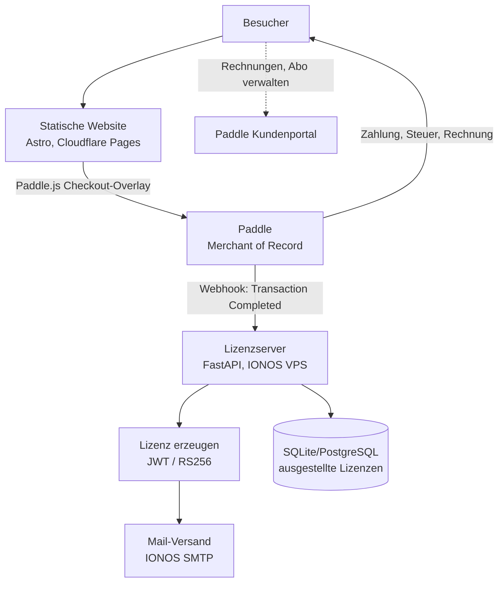
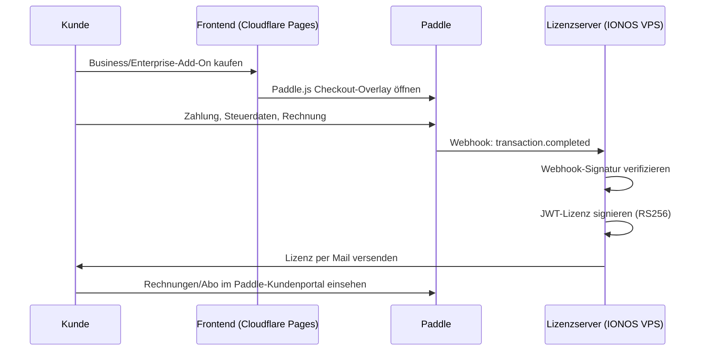

# Installation: HumanShield Awareness – Website (Paddle) & Lizenzserver

## Zweck

Dieses Dokument beschreibt Aufbau und Installation von **humanshield-awareness.de**:
eine vollständig statische Marketing-/Kaufseite (Cloudflare Pages) mit Paddle als
Merchant of Record für Checkout, Steuern und Rechnungsstellung, sowie einem
schlanken **Lizenzserver** auf einem IONOS VPS, der ausschließlich für Business-
und Enterprise-Add-Ons JWT-Lizenzen erzeugt und per Mail versendet.

Kundenkonto, Rechnungen und Abo-Verwaltung laufen vollständig über **Paddles
eigenes Kundenportal** – dafür wird keine eigene Infrastruktur benötigt.

## Architekturüberblick



## Komponentenübersicht

| Komponente | Technologie | Betrieb |
|---|---|---|
| Frontend | Astro (statisch) + Paddle.js | Cloudflare Pages, Deploy aus GitHub |
| Zahlungsanbieter | **Paddle** (Merchant of Record) | extern, übernimmt Checkout, VAT, Invoicing |
| Kundenportal | Paddle-eigenes Portal | extern, kein eigener Code nötig |
| Lizenzserver | FastAPI (Python 3.12), Webhook-Empfänger | IONOS VPS, systemd-Service |
| Datenbank | SQLite (Standard) oder PostgreSQL | lokal auf VPS, nur ausgestellte Lizenzen |
| Reverse Proxy | Caddy (standalone) | IONOS VPS |
| Lizenzformat | JWT, RS256-signiert | offline verifizierbar in Client-Software |
| Mail-Versand | IONOS SMTP (bestehend) | für Lizenzversand |

**Wichtiger Unterschied zum vorherigen Konzept:** Es gibt keinen eigenen
Checkout-Endpoint mehr – Paddle.js übernimmt den kompletten Kaufvorgang direkt
im Frontend. Der VPS wird ausschließlich für die Lizenzerstellung nach
Zahlungseingang gebraucht (Webhook → JWT → Mail).

## Voraussetzungen

- IONOS VPS (Ubuntu 24.04 LTS empfohlen), Root-Zugriff
- Domain `humanshield-awareness.de` mit DNS-Zugriff (A-Record auf VPS-IP für `license.`-Subdomain)
- GitHub-Repository für das Frontend (Cloudflare Pages Deploy-Quelle)
- Paddle-Account (Sandbox + Live), Produkte für Business/Enterprise-Tier angelegt
- Bestehender IONOS-Mailaccount für SMTP-Versand

## Installationsschritte

### 1. Basissystem VPS

```bash
apt update && apt upgrade -y
apt install -y python3.12 python3.12-venv caddy
```

> PostgreSQL entfällt in der Standardvariante – SQLite genügt für reine
> Lizenzausstellung ohne parallele Schreiblast. Bei Bedarf (z. B. hohe
> Verkaufszahlen) kann später auf PostgreSQL migriert werden.

### 2. Lizenzserver-Verzeichnis & venv

```bash
mkdir -p /opt/humanshield-license
cd /opt/humanshield-license
python3.12 -m venv venv
source venv/bin/activate
pip install fastapi uvicorn sqlalchemy "python-jose[cryptography]" \
    python-dotenv pydantic-settings httpx
```

### 3. Secrets (.env)

```bash
cat > /opt/humanshield-license/.env << 'EOF'
DATABASE_URL=sqlite:///./licenses.db
PADDLE_API_KEY=live_xxx
PADDLE_WEBHOOK_SECRET=whsec_xxx
JWT_PRIVATE_KEY_PATH=/opt/humanshield-license/keys/license_private.pem
JWT_PUBLIC_KEY_PATH=/opt/humanshield-license/keys/license_public.pem
SMTP_HOST=smtp.ionos.de
SMTP_PORT=587
SMTP_USER=noreply@humanshield-awareness.de
SMTP_PASSWORD=CHANGE_ME
EOF
chmod 600 /opt/humanshield-license/.env
```

### 4. RSA-Schlüsselpaar für Lizenzsignierung

```bash
mkdir -p /opt/humanshield-license/keys
openssl genrsa -out /opt/humanshield-license/keys/license_private.pem 3072
openssl rsa -in /opt/humanshield-license/keys/license_private.pem \
    -pubout -out /opt/humanshield-license/keys/license_public.pem
chmod 600 /opt/humanshield-license/keys/license_private.pem
```

Der öffentliche Schlüssel wird in die HumanShield-Client-Software eingebettet,
um Business/Enterprise-Lizenzen offline zu validieren.

### 5. systemd-Service

```bash
cat > /etc/systemd/system/humanshield-license.service << 'EOF'
[Unit]
Description=HumanShield Lizenzserver
After=network.target

[Service]
User=www-data
WorkingDirectory=/opt/humanshield-license
EnvironmentFile=/opt/humanshield-license/.env
ExecStart=/opt/humanshield-license/venv/bin/uvicorn app.main:app --host 127.0.0.1 --port 8000
Restart=on-failure

[Install]
WantedBy=multi-user.target
EOF

systemctl daemon-reload
systemctl enable --now humanshield-license
```

### 6. Caddy als Reverse Proxy

```
# /etc/caddy/Caddyfile
license.humanshield-awareness.de {
    reverse_proxy 127.0.0.1:8000
}
```

```bash
systemctl reload caddy
```

### 7. Cloudflare Pages (Frontend) mit Paddle.js

1. GitHub-Repository mit Astro-Projekt anlegen
2. Paddle.js im Frontend einbinden (Overlay-Checkout, kein eigener Redirect nötig)
3. In Cloudflare Dashboard: Pages → GitHub verbinden → Repository wählen
4. Build-Command: `npm run build`, Output-Verzeichnis: `dist`
5. Custom Domain `humanshield-awareness.de` in Cloudflare Pages hinterlegen
6. Paddle Client-Token als Environment Variable: `PUBLIC_PADDLE_CLIENT_TOKEN`

### 8. Paddle-Webhook konfigurieren

Im Paddle-Dashboard unter Notifications/Webhooks:
`https://license.humanshield-awareness.de/webhooks/paddle`

Relevante Events: `transaction.completed` (ggf. `subscription.activated` bei
Abo-Modell für Enterprise).

## Zahlungs- und Lizenzfluss



## Betrieb & Wartung

- **Backups:** `licenses.db` (SQLite) regelmäßig sichern, z. B. täglich per `cron` auf externen Speicher kopieren
- **TLS:** automatisch durch Caddy
- **Webhook-Sicherheit:** Signaturprüfung mit `PADDLE_WEBHOOK_SECRET` ist zwingend, sonst könnten gefälschte Webhooks Lizenzen auslösen
- **Monitoring:** Healthcheck auf `https://license.humanshield-awareness.de/health`
- **Kein eigenes Kundenkonto zu pflegen** – Rechnungen/Abo-Verwaltung liegt komplett bei Paddle

## VPS-Anforderungen (aktualisiert)

Da der VPS jetzt ausschließlich als Webhook-Empfänger und Lizenzgenerator dient
(kein Checkout-Backend, keine eigene Kundendatenbank mehr), reicht eine
kleinere Instanz als ursprünglich geplant:

| Ressource | Empfehlung | Begründung |
|---|---|---|
| vCPU | 1–2 Kerne | geringe, unregelmäßige Last (nur bei Verkäufen) |
| RAM | 2 GB | FastAPI + SQLite + Caddy, kein PostgreSQL nötig |
| Storage | 20–40 GB SSD | SQLite-Datei bleibt klein, Puffer für Logs/System |
| OS | Ubuntu 24.04 LTS | konsistent mit bestehender Infrastruktur |

## Offene Punkte

- [ ] Paddle-Produkte für Business/Enterprise final anlegen (Preise, Tax-Kategorie)
- [ ] Entscheidung: Enterprise als Abo (Subscription) oder Einmalzahlung?
- [ ] Sandbox-Test des kompletten Flows vor Live-Schaltung
