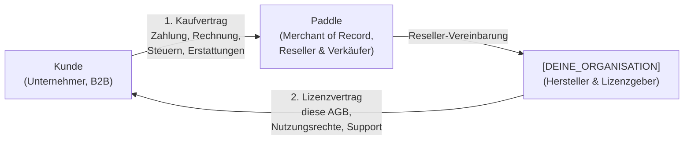
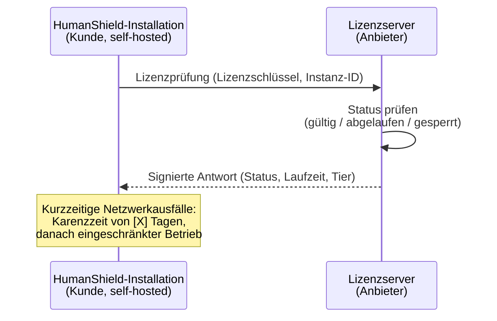

# Allgemeine Geschäftsbedingungen (AGB) & Lizenzbedingungen

**HumanShield – Phishing-Awareness-Training (Self-Hosted)**

**Version:** 1.0
**Gültig ab:** 11.07.2026
**Anbieter/Lizenzgeber:** HumanShield Awareness UG (haftungsbeschränkt), Lindental 8d, 94032 Passau (siehe [Impressum](./impressum.md))

---

## § 1 Geltungsbereich und Vertragsstruktur

### 1.1 Geltungsbereich

Diese AGB regeln die Lizenzierung und Nutzung der Software **HumanShield** in den kostenpflichtigen Varianten (Business-Lizenz und Enterprise-Add-on) sowie ergänzend die Nutzung der kostenlosen Open-Core-Variante.

Die Software wird ausschließlich als **Self-Hosted-Lösung** bereitgestellt: Der Kunde installiert und betreibt die Software **auf eigener Infrastruktur**. Der Anbieter erbringt **keine SaaS-, Hosting- oder Betriebsleistungen**.

### 1.2 Ausschließlich B2B — kein Verbrauchergeschäft

Das Angebot richtet sich **ausschließlich an Unternehmer im Sinne des § 14 BGB**, juristische Personen des öffentlichen Rechts und öffentlich-rechtliche Sondervermögen.

- Mit Abschluss der Bestellung bestätigt der Kunde, dass er als Unternehmer handelt.
- Verbraucher im Sinne des § 13 BGB sind vom Erwerb ausgeschlossen.
- **Ein Widerrufsrecht besteht nicht**, da die gesetzlichen Widerrufsvorschriften (§§ 312g, 355 BGB) nur auf Verbraucherverträge Anwendung finden. Etwaige Kulanz-Erstattungen richten sich ausschließlich nach der Refund-Policy von Paddle (§ 4).

### 1.3 Vertragsstruktur: Zwei Vertragsverhältnisse

Beim Erwerb einer Lizenz kommen **zwei getrennte Vertragsverhältnisse** zustande:

**1. Kaufvertrag mit Paddle:**
Vertragspartner des Kunden für den **Erwerb** der Lizenz (Bestellung, Zahlung, Rechnungsstellung, Steuern) ist:

> **Paddle.com Market Ltd.** bzw. **Paddle.com Inc.** (je nach Region)
> Paddle handelt als **Merchant of Record (Reseller)** und ist Verkäufer der Lizenz.
> Es gelten ergänzend die Paddle Buyer Terms: https://www.paddle.com/legal/checkout-buyer-terms

**2. Lizenzvertrag mit dem Anbieter:**
Die **Nutzungsrechte** an der Software sowie Support- und Update-Leistungen richten sich nach diesen AGB. Lizenzgeber bleibt der Anbieter.

### 1.4 Alleiniger Ansprechpartner für Zahlungsabwicklung

**Paddle ist alleiniger Ansprechpartner für sämtliche Fragen der Zahlungsabwicklung**, insbesondere:

- Rechnungen und Zahlungsbelege
- Zahlungsmethoden und fehlgeschlagene Zahlungen
- Umsatzsteuer / VAT (inkl. Reverse-Charge bei gültiger USt-IdNr.)
- Erstattungen und Zahlungsstreitigkeiten

Kontakt: über das Paddle-Kundenportal oder https://www.paddle.net

Der Anbieter hat **keinen Zugriff auf Zahlungsdaten** des Kunden und kann keine Rechnungen ausstellen oder ändern.

### 1.5 Abweichende Bedingungen

Entgegenstehende oder abweichende Einkaufsbedingungen des Kunden finden keine Anwendung, es sei denn, der Anbieter stimmt ihnen ausdrücklich schriftlich zu.

---

## § 2 Vertragsgegenstand und Leistungsumfang

### 2.1 Produktvarianten

| Variante | Bezug | Betrieb |
|---|---|---|
| **Open Core** | Kostenlos (GitHub) | Self-Hosted |
| **Business-Lizenz** | Kostenpflichtig (jährlich, via Paddle) | Self-Hosted |
| **Enterprise-Add-on** | Kostenpflichtig, **nur als Upgrade zu einer aktiven Business-Lizenz** | Self-Hosted |

### 2.2 Funktionsumfang

Der jeweils aktuelle und verbindliche Funktionsumfang der einzelnen Varianten ist auf der Produktwebsite einsehbar:

> **https://humanshield-awareness.de**

Maßgeblich ist der dort zum Zeitpunkt des Lizenzerwerbs bzw. der Verlängerung dokumentierte Funktionsumfang. Der Anbieter behält sich vor, den Funktionsumfang weiterzuentwickeln; § 10.2 (wesentliche Änderungen) bleibt unberührt.

### 2.3 Enterprise-Add-on

Das Enterprise-Add-on ist **kein eigenständiges Produkt**, sondern ausschließlich als **Erweiterung einer bestehenden, aktiven Business-Lizenz** erhältlich:

- Voraussetzung: gültige, nicht gesperrte Business-Lizenz
- Laufzeit: Das Add-on teilt die Laufzeit der zugrundeliegenden Business-Lizenz
- Bei Kündigung, Ablauf oder Sperrung der Business-Lizenz **endet das Enterprise-Add-on automatisch**
- Preis: siehe Produktwebsite

### 2.4 Self-Hosted: Verantwortungsabgrenzung

Da der Kunde die Software auf eigener Infrastruktur betreibt, gilt folgende Abgrenzung:

| Verantwortungsbereich | Anbieter | Kunde |
|---|---|---|
| Bereitstellung der Software (Download) | ✅ | — |
| Lizenzserver-Betrieb (Lizenzprüfung, § 3.4) | ✅ | — |
| Installation, Konfiguration, Betrieb | — | ✅ |
| Server, Netzwerk, Betriebssystem | — | ✅ |
| Backups & Disaster Recovery | — | ✅ |
| Absicherung der eigenen Infrastruktur | — | ✅ |
| Verfügbarkeit der Kundeninstallation | — | ✅ |
| Updates einspielen | — | ✅ (Bereitstellung: Anbieter) |
| DSGVO-Compliance ggü. Endnutzern | — | ✅ (Kunde = Verantwortlicher) |

Der Anbieter schuldet **keine Verfügbarkeit der Kundeninstallation** und keine Betriebsleistungen.

---

## § 3 Lizenz und Nutzungsrechte

### 3.1 Open Core (kostenlos)

Die Open-Core-Variante wird unter der im Repository (GitHub, Organisation *securebitsorg*) angegebenen Open-Source-Lizenz bereitgestellt. Es gilt ausschließlich der dortige Lizenztext.

**Die Open-Core-Variante wird ohne jede Gewährleistung, Garantie oder Support-Zusage bereitgestellt ("as is").** Ansprüche auf Fehlerbehebung, Updates, Support oder bestimmte Funktionen bestehen nicht. § 8.1 gilt entsprechend.

### 3.2 Business-Lizenz und Enterprise-Add-on (kommerziell)

Mit vollständiger Zahlung erhält der Kunde für die Vertragslaufzeit ein **einfaches, nicht ausschließliches, nicht übertragbares und nicht unterlizenzierbares Recht**, die Software im lizenzierten Umfang (Nutzerzahl, Funktionsumfang gemäß Lizenz-Tier) auf eigener Infrastruktur zu betreiben.

**Nicht gestattet ist insbesondere:**

- Nutzung über die lizenzierte Nutzerzahl hinaus
- Weitergabe, Vermietung, Verleih oder Unterlizenzierung der Lizenz
- Nutzung einer Lizenz durch mehrere rechtlich selbständige Unternehmen (ausgenommen verbundene Unternehmen i.S.d. § 15 AktG, sofern in der Lizenz vereinbart)
- Umgehung, Deaktivierung oder Manipulation der Lizenzprüfung (§ 3.4)
- Entfernen von Urheberrechts- und Lizenzvermerken

Dekompilierung ist nur in den engen Grenzen des § 69e UrhG zulässig.

### 3.3 Lizenzzustellung

Nach erfolgreicher Zahlung über Paddle wird der Lizenzschlüssel automatisiert an die beim Kauf angegebene E-Mail-Adresse zugestellt (Ziel: innerhalb weniger Minuten). Bei Verzögerung: support@humanshield.app.

### 3.4 Online-Lizenzprüfung

Die Software validiert die Lizenz **online gegen den Lizenzserver des Anbieters**:

**Es gilt:**

- Die Kundeninstallation benötigt für die Lizenzprüfung eine **ausgehende Internetverbindung zum Lizenzserver des Anbieters** (Endpunkt und Frequenz gemäß technischer Dokumentation).
- Übermittelt werden ausschließlich die zur Lizenzprüfung erforderlichen Daten (Lizenzschlüssel, Instanz-Kennung, Produktversion, Zeitstempel). **Keine Trainings- oder Endnutzerdaten** verlassen die Kundeninstallation.
- Bei vorübergehender Nichterreichbarkeit des Lizenzservers gilt eine **Karenzzeit von 14 Tagen** (zuletzt gültiger Lizenzstatus wird lokal zwischengespeichert). Nach Ablauf der Karenzzeit ohne erfolgreiche Prüfung wechselt die Software in einen eingeschränkten Modus.
- Der Anbieter ist berechtigt, Lizenzen bei Zahlungsausfall, Chargeback oder Verstößen gegen § 3.2 **serverseitig zu sperren** (Verfahren: § 9.3).
- Der Anbieter wird die Verfügbarkeit des Lizenzservers mit der Sorgfalt eines ordentlichen Kaufmanns sicherstellen; die Karenzzeit stellt sicher, dass kurzfristige Ausfälle des Lizenzservers den Betrieb beim Kunden nicht beeinträchtigen.

---

## § 4 Preise, Zahlung und Laufzeit

### 4.1 Abrechnung ausschließlich jährlich

Lizenzen werden **ausschließlich mit jährlicher Laufzeit und jährlicher Abrechnung im Voraus** angeboten. Eine monatliche Zahlweise besteht nicht.

### 4.2 Preise

Es gelten die zum Bestellzeitpunkt auf **https://humanshield-awareness.de** bzw. im Paddle-Checkout ausgewiesenen Preise. Preise verstehen sich netto; Umsatzsteuer wird von Paddle gemäß den anwendbaren Steuervorschriften berechnet und ausgewiesen (bei gültiger USt-IdNr. ggf. Reverse-Charge).

### 4.3 Zahlungsabwicklung über Paddle

- Zahlung, Rechnungsstellung und Steuerabführung erfolgen **ausschließlich durch Paddle** als Merchant of Record (§ 1.3, § 1.4).
- Es gelten die im Paddle-Checkout angebotenen Zahlungsmethoden.
- **Erstattungen** richten sich ausschließlich nach der Refund-Policy von Paddle und werden von Paddle bearbeitet. Ein darüberhinausgehender Erstattungsanspruch gegen den Anbieter besteht nicht.

### 4.4 Verlängerung

Die Lizenz verlängert sich automatisch um jeweils **12 Monate**, sofern sie nicht gemäß § 9.1 gekündigt wird. Die Verlängerungszahlung wird von Paddle zum jeweiligen Stichtag eingezogen.

### 4.5 Zahlungsausfall

Schlägt eine Verlängerungszahlung fehl oder erfolgt ein Chargeback, ist der Anbieter nach erfolglosem Ablauf einer per E-Mail gesetzten Nachfrist von **14 Tagen** berechtigt, die Lizenz serverseitig zu sperren (§ 3.4, § 9.3).

---

## § 5 Support und Updates

### 5.1 Support-Umfang (nur kommerzielle Lizenzen)

| Leistung | Open Core | Business | Business + Enterprise-Add-on |
|---|---|---|---|
| Community (GitHub Issues) | ✅ | ✅ | ✅ |
| E-Mail-Support | ❌ | ✅ (Reaktionszeit: [1] Werktage) | ✅ (Reaktionszeit: [4] Stunden) |
| Unterstützung bei Installation/Update | ❌ | eingeschränkt | ✅ |
| Priorisierte Behandlung | ❌ | ❌ | ✅ |

Support umfasst Hilfestellung zur bestimmungsgemäßen Nutzung der Software. **Nicht umfasst** sind: Betrieb der Kundeninfrastruktur, individuelle Entwicklung, Anpassungen, Beratungsleistungen (separat beauftragbar).

Reaktionszeiten sind Zielwerte innerhalb der Geschäftszeiten (Mo–Fr, 09:00–17:00 Uhr, Deutschland, Bundesland Bayern, keine Feiertage); sie stellen keine Wiederherstellungszeiten dar.

### 5.2 Updates

Während der Lizenzlaufzeit stellt der Anbieter Updates (Fehlerbehebungen, Sicherheitsupdates, funktionale Weiterentwicklungen) zum Download bereit. **Das Einspielen der Updates obliegt dem Kunden.** Ein Anspruch auf bestimmte künftige Funktionen besteht nicht.

---

## § 6 Pflichten des Kunden

### 6.1 Bestimmungsgemäße Nutzung

Die Software dient ausschließlich der **Sensibilisierung und Schulung der eigenen Mitarbeitenden** (bzw. der Mitarbeitenden von Kunden, sofern der Kunde als beauftragter Dienstleister mit entsprechender Befugnis handelt).

**Untersagt ist insbesondere:**

- Einsatz gegen Personen oder Organisationen **ohne deren Befugnis/Beauftragung** (echtes Phishing, § 202a ff. StGB u.a.)
- Nutzung zur Erlangung von Zugangsdaten Dritter außerhalb autorisierter Simulationen
- Jede rechtswidrige Nutzung

Bei Verstoß ist der Anbieter zur fristlosen Kündigung und sofortigen Lizenzsperrung berechtigt; weitergehende Ansprüche bleiben vorbehalten.

### 6.2 Datenschutz- und arbeitsrechtliche Verantwortung

Der Kunde betreibt die Software auf eigener Infrastruktur und ist **alleiniger datenschutzrechtlicher Verantwortlicher** (Art. 4 Nr. 7 DSGVO) für die Verarbeitung von Endnutzerdaten. Der Kunde stellt insbesondere sicher:

- Rechtsgrundlage für Phishing-Simulationen (z.B. berechtigtes Interesse, Betriebsvereinbarung)
- Beteiligung des Betriebsrats, soweit erforderlich (§ 87 BetrVG)
- Information der Beschäftigten gemäß Art. 13/14 DSGVO im erforderlichen Umfang

Da keine Endnutzerdaten an den Anbieter übermittelt werden (§ 3.4), ist ein Auftragsverarbeitungsvertrag für den Softwarebetrieb regelmäßig nicht erforderlich.

### 6.3 Mitwirkung

Der Kunde sorgt für die technischen Voraussetzungen gemäß Systemanforderungen (siehe Dokumentation), einschließlich der ausgehenden Verbindung zum Lizenzserver (§ 3.4).

---

## § 7 Gewährleistung (kommerzielle Lizenzen)

7.1 Es gilt das gesetzliche Gewährleistungsrecht mit folgenden Maßgaben für Unternehmer.

7.2 Der Kunde hat offensichtliche Mängel unverzüglich, spätestens innerhalb von **14 Tagen** nach Entdeckung, in Textform zu rügen.

7.3 Die Verjährungsfrist für Mängelansprüche beträgt **12 Monate** ab Lizenzzustellung, außer bei Vorsatz, grober Fahrlässigkeit sowie bei Schäden aus der Verletzung von Leben, Körper oder Gesundheit.

7.4 Keine Mängel sind insbesondere: Fehler infolge unsachgemäßer Installation/Konfiguration durch den Kunden, Modifikationen durch den Kunden, Betrieb außerhalb der Systemanforderungen, unterlassene Updates.

7.5 **Für die Open-Core-Variante gilt ausschließlich § 3.1** (keine Gewährleistung).

---

## § 8 Haftung

8.1 Der Anbieter haftet unbeschränkt bei Vorsatz und grober Fahrlässigkeit, bei Verletzung von Leben, Körper oder Gesundheit, nach dem Produkthaftungsgesetz sowie im Umfang einer übernommenen Garantie.

8.2 Bei leicht fahrlässiger Verletzung wesentlicher Vertragspflichten (Kardinalpflichten) ist die Haftung auf den **vertragstypischen, vorhersehbaren Schaden** begrenzt, maximal auf die **vom Kunden in den letzten 12 Monaten vor dem Schadensereignis gezahlten Lizenzentgelte**. Im Übrigen ist die Haftung für leichte Fahrlässigkeit ausgeschlossen.

8.3 **Keine Haftung besteht insbesondere für:**

- Schäden durch reale Phishing- oder Cyberangriffe Dritter; die Software erhöht die Awareness, garantiert aber keinen Schutz vor Angriffen
- Datenverlust, soweit er durch ordnungsgemäße Datensicherung des Kunden (§ 2.4) vermeidbar gewesen wäre
- Ausfälle der Kundeninfrastruktur

8.4 Die Haftungsbeschränkungen gelten auch zugunsten der Organe, Mitarbeitenden und Erfüllungsgehilfen des Anbieters.

---

## § 9 Laufzeit, Kündigung, Lizenzsperrung

### 9.1 Ordentliche Kündigung

Die Lizenz kann von beiden Seiten **mit einer Frist von [30] Tagen zum Ende der jeweiligen Jahreslaufzeit** gekündigt werden:

- Durch den Kunden: über das **Paddle-Kundenportal** (Abo-Verwaltung)
- Durch den Anbieter: in Textform an die hinterlegte E-Mail-Adresse

### 9.2 Außerordentliche Kündigung

Das Recht zur fristlosen Kündigung aus wichtigem Grund bleibt unberührt. Ein wichtiger Grund für den Anbieter liegt insbesondere vor bei: Verstößen gegen § 3.2 oder § 6.1, Chargeback ohne berechtigten Grund, Zahlungsausfall nach Nachfrist (§ 4.5).

### 9.3 Lizenzsperrung (Verfahren)

Vor einer serverseitigen Sperrung (außer bei Gefahr im Verzug, z.B. Missbrauch nach § 6.1):

1. Ankündigung per E-Mail mit Fristsetzung (**7 Tage**)
2. Nach fruchtlosem Fristablauf: Sperrung über den Lizenzserver
3. Entsperrung nach Beseitigung des Sperrgrundes

### 9.4 Folgen der Beendigung

- Das Nutzungsrecht erlischt zum Laufzeitende; die Software wechselt in den eingeschränkten Modus bzw. auf den Open-Core-Funktionsumfang (sofern technisch vorgesehen)
- Das Enterprise-Add-on endet automatisch mit der Business-Lizenz (§ 2.3)
- **Kundendaten verbleiben beim Kunden** (Self-Hosted) — ein Datenexport durch den Anbieter ist weder erforderlich noch möglich
- Beim Anbieter gespeicherte Lizenz-/Kundendaten werden gemäß Datenschutzerklärung gelöscht, soweit keine gesetzlichen Aufbewahrungspflichten bestehen

---

## § 10 Änderungen

### 10.1 Änderungen dieser AGB

Der Anbieter kann diese AGB mit Wirkung für die Zukunft ändern. Änderungen werden dem Kunden mindestens **30 Tage** vor Inkrafttreten in Textform mitgeteilt und gelten mit der nächsten Vertragsverlängerung. Widerspricht der Kunde, läuft der Vertrag zu den bisherigen Bedingungen bis zum Ende der laufenden Lizenzperiode und endet dann.

### 10.2 Preis- und Leistungsänderungen

Preisänderungen wirken frühestens zur **nächsten Verlängerung** und werden mindestens **30 Tage** vorher angekündigt. Bei wesentlicher Einschränkung des Funktionsumfangs während der Laufzeit steht dem Kunden ein Sonderkündigungsrecht zum Zeitpunkt des Wirksamwerdens zu.

---

## § 11 Schlussbestimmungen

11.1 **Anwendbares Recht:** Es gilt das Recht der Bundesrepublik Deutschland unter Ausschluss des UN-Kaufrechts (CISG).

11.2 **Gerichtsstand:** Ausschließlicher Gerichtsstand für alle Streitigkeiten aus oder im Zusammenhang mit diesem Vertrag ist Passau, Deutschland, sofern der Kunde Kaufmann, juristische Person des öffentlichen Rechts oder öffentlich-rechtliches Sondervermögen ist.

11.3 **Textform:** Änderungen und Ergänzungen bedürfen der Textform; dies gilt auch für die Abbedingung dieses Textformerfordernisses.

11.4 **Salvatorische Klausel:** Sollten einzelne Bestimmungen unwirksam sein oder werden, bleibt die Wirksamkeit der übrigen Bestimmungen unberührt.

11.5 **Rangfolge:** Für den Erwerb (Kauf/Zahlung) gehen die Paddle Buyer Terms vor; für Nutzungsrechte, Support und alle übrigen Regelungen gelten diese AGB.

---

## Anlagen & verwandte Dokumente

- 📄 [Impressum](./impressum.md)
- 🔐 [Datenschutzerklärung](./datenschutz.md)
- 🛒 Paddle Buyer Terms: https://www.paddle.com/legal/checkout-buyer-terms
- 🌐 Funktionsübersicht: https://humanshield-awareness.de

---
