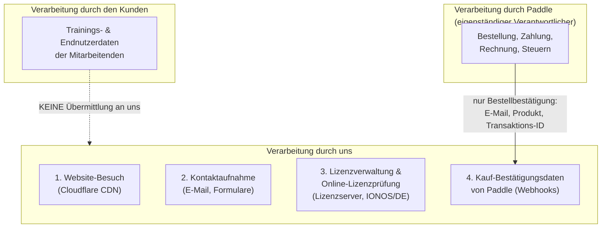

# Datenschutzerklärung

**HumanShield – humanshield.app / humanshield-awareness.de und dessen Dienste**

**Version:** 1.0
**Stand:** 11.07.2026

---

## 1. Verantwortlicher

Verantwortlicher im Sinne der Datenschutz-Grundverordnung (DSGVO) für die Verarbeitung personenbezogener Daten auf dieser Website und im Rahmen der Lizenzverwaltung ist:

```
HumanShield Awareness UG (haftungsbeschränkt) in Gründung
Lindental 8d
94032 Passau
Deutschland

E-Mail: legal@humanshield.app
```

Weitere Angaben: siehe [Impressum](./impressum.md).

Ein Datenschutzbeauftragter ist [nicht benannt, da gesetzlich nicht erforderlich / benannt: NAME, KONTAKT].

---

## 2. Überblick: Wo verarbeiten wir welche Daten?

**Wichtig vorab — Self-Hosted-Prinzip:** Die HumanShield-Software wird von unseren Kunden **auf eigener Infrastruktur** betrieben. Sämtliche Trainings-, Simulations- und Mitarbeiterdaten verbleiben **vollständig beim Kunden**. Wir haben darauf **keinen Zugriff** und verarbeiten diese Daten **nicht**.

Wir verarbeiten personenbezogene Daten nur in vier Zusammenhängen:



---

## 3. Website-Besuch (humanshield.app / humanshield-awareness.de)

### 3.1 Hosting und Auslieferung über Cloudflare

Unsere Website wird als statische Website über **Cloudflare Pages** bereitgestellt (Cloudflare, Inc., 101 Townsend St., San Francisco, CA 94107, USA; für den EWR: Cloudflare Germany GmbH bzw. Cloudflare, Inc. gemäß Cloudflare-DPA).

Beim Aufruf der Website verarbeitet Cloudflare technisch bedingt:

- IP-Adresse
- Datum und Uhrzeit des Zugriffs
- Aufgerufene URL, Referrer
- Browsertyp/-version, Betriebssystem (User-Agent)
- Übertragene Datenmenge, HTTP-Statuscode

**Zwecke:** Auslieferung der Website, Lastverteilung (CDN), Schutz vor Angriffen (DDoS, Bots), Fehleranalyse.

**Rechtsgrundlage:** Art. 6 Abs. 1 lit. f DSGVO. Unser berechtigtes Interesse liegt in der sicheren, performanten und angriffsresistenten Bereitstellung der Website.

**Speicherdauer:** Server-Logs werden von Cloudflare nach kurzer Zeit gelöscht bzw. aggregiert; wir selbst speichern keine Zugriffslogs der Website.

**Drittlandübermittlung:** Cloudflare ist unter dem **EU-U.S. Data Privacy Framework (DPF)** zertifiziert; ergänzend bestehen **Standardvertragsklauseln (SCC)** im Rahmen des Cloudflare-Datenverarbeitungsvertrags (Art. 28 DSGVO).
Details: https://www.cloudflare.com/privacypolicy/

### 3.2 Cookies

Wir setzen **keine Analyse-, Marketing- oder Tracking-Cookies** ein und verwenden keine Dienste wie Google Analytics oder Meta Pixel.

Technisch notwendige Cookies können durch Cloudflare gesetzt werden:

| Cookie | Zweck | Speicherdauer | Rechtsgrundlage |
|---|---|---|---|
| `__cf_bm` | Bot-Erkennung / Sicherheit | ca. 30 Minuten | § 25 Abs. 2 Nr. 2 TDDDG; Art. 6 Abs. 1 lit. f DSGVO |
| `cf_clearance` | Nachweis bestandener Sicherheitsprüfung | bis zu 1 Jahr | § 25 Abs. 2 Nr. 2 TDDDG; Art. 6 Abs. 1 lit. f DSGVO |

Da ausschließlich technisch erforderliche Cookies eingesetzt werden, ist kein Cookie-Consent-Banner erforderlich.

---

## 4. Kontaktaufnahme

Bei Kontaktaufnahme per E-Mail (support@humanshield.app) oder über ein Kontaktformular verarbeiten wir die von Ihnen mitgeteilten Daten (Name, E-Mail-Adresse, Unternehmen, Inhalt der Anfrage).

**Zweck:** Bearbeitung und Beantwortung Ihrer Anfrage; Anbahnung oder Durchführung eines Vertrags.

**Rechtsgrundlage:** Art. 6 Abs. 1 lit. b DSGVO (vertragliche/vorvertragliche Maßnahmen) bzw. Art. 6 Abs. 1 lit. f DSGVO (berechtigtes Interesse an der Beantwortung allgemeiner Anfragen).

**Speicherdauer:** Löschung nach abschließender Bearbeitung, spätestens nach [12] Monaten, sofern keine gesetzlichen Aufbewahrungspflichten (z.B. geschäftliche Korrespondenz nach § 257 HGB, § 147 AO: 6 bzw. 8/10 Jahre) entgegenstehen.

---

## 5. Bestellung und Zahlung über Paddle

### 5.1 Paddle als eigenständiger Verantwortlicher

Der Erwerb von HumanShield-Lizenzen erfolgt über **Paddle** als **Merchant of Record (Reseller)**:

> Paddle.com Market Ltd., Judd House, 18-29 Mora Street, London EC1V 8BT, Vereinigtes Königreich
> (für Käufer außerhalb Europas ggf. Paddle.com Inc., USA)

Paddle ist **Verkäufer** der Lizenz und verarbeitet die im Rahmen der Bestellung und Zahlung erhobenen Daten (Name, E-Mail-Adresse, Rechnungsadresse, USt-IdNr., Zahlungsdaten) als **eigenständiger datenschutzrechtlicher Verantwortlicher** — nicht in unserem Auftrag.

Für die Zahlungsabwicklung, Rechnungsstellung und Erstattungen ist **ausschließlich Paddle Ansprechpartner** (siehe AGB § 1.4).

**Datenschutzerklärung von Paddle:** https://www.paddle.com/legal/privacy

**Zahlungsdaten (Kreditkartennummern etc.) werden zu keinem Zeitpunkt an uns übermittelt.**

### 5.2 Was wir von Paddle erhalten (Webhooks)

Nach einem Kauf, einer Verlängerung oder einer Kündigung übermittelt Paddle an unseren Lizenzserver per Webhook die zur Lizenzverwaltung erforderlichen Daten:

- E-Mail-Adresse des Käufers
- Name / Unternehmen (soweit im Checkout angegeben)
- Erworbenes Produkt / Lizenz-Tier
- Transaktions- und Abonnement-ID (Paddle-Referenzen)
- Abo-Status (aktiv, gekündigt, Zahlung fehlgeschlagen)

**Zweck:** Erzeugung, Zustellung, Verlängerung und ggf. Sperrung Ihrer Lizenz; Zuordnung von Supportanfragen.

**Rechtsgrundlage:** Art. 6 Abs. 1 lit. b DSGVO (Durchführung des Lizenzvertrags).

**Speicherdauer:** Für die Dauer des Lizenzvertrags zuzüglich [12] Monate; Daten mit handels- und steuerrechtlicher Relevanz gemäß gesetzlichen Fristen (§ 257 HGB, § 147 AO).

---

## 6. Online-Lizenzprüfung (Lizenzserver)

### 6.1 Funktionsweise

Die beim Kunden installierte HumanShield-Software validiert ihre Lizenz **online gegen unseren Lizenzserver**. Dieser wird auf einem Server der **Hostinger** (Švitrigailos str. 34, Vilnius 03230 Litauen) in einem **deutschen Rechenzentrum** betrieben und ist nach **BSI IT-Grundschutz-Prinzipien** gehärtet (u.a. Zugriffskontrolle, Protokollierung, Verschlüsselung der Übertragung per TLS).

### 6.2 Verarbeitete Daten

Bei jeder Lizenzprüfung werden ausschließlich übermittelt und verarbeitet:

| Datum | Zweck |
|---|---|
| Lizenzschlüssel | Zuordnung und Statusprüfung der Lizenz |
| Instanz-Kennung (technische ID der Installation) | Erkennung unzulässiger Mehrfachnutzung |
| Produktversion | Kompatibilitäts- und Sicherheitshinweise |
| Zeitstempel | Protokollierung der Prüfung |
| IP-Adresse (technisch bedingt) | Verbindungsaufbau, Missbrauchsabwehr |

**Ausdrücklich NICHT übermittelt werden:** Namen, E-Mail-Adressen oder sonstige Daten der Mitarbeitenden des Kunden, Trainingsergebnisse, Simulationsdaten, Inhalte jeglicher Art. Die Lizenzprüfung enthält keine Personendaten der Endnutzer.

**Zweck:** Prüfung der Lizenzgültigkeit, Schutz vor Lizenzmissbrauch, Abwehr von Angriffen auf den Lizenzserver.

**Rechtsgrundlage:** Art. 6 Abs. 1 lit. b DSGVO (Durchführung des Lizenzvertrags) sowie Art. 6 Abs. 1 lit. f DSGVO (berechtigtes Interesse am Schutz vor Lizenzmissbrauch und an der Sicherheit unserer Systeme).

**Speicherdauer:** Prüfprotokolle des Lizenzservers werden nach [90] Tagen gelöscht bzw. anonymisiert; sicherheitsrelevante Protokolle (z.B. bei Angriffserkennung) können im Einzelfall bis zur Klärung des Vorfalls aufbewahrt werden.

### 6.3 Trainings- und Endnutzerdaten (Self-Hosted)

Die eigentliche Anwendung — Phishing-Simulationen, Trainingsinhalte, Auswertungen, Mitarbeiterdaten — läuft vollständig **auf der Infrastruktur des Kunden**. Datenschutzrechtlich Verantwortlicher für diese Verarbeitung ist **ausschließlich der Kunde**. Wir erhalten und verarbeiten diese Daten nicht; ein Auftragsverarbeitungsverhältnis (Art. 28 DSGVO) besteht insoweit nicht.

Mitarbeitende von Kundenunternehmen, die Fragen zu einer Phishing-Simulation oder ihren dabei verarbeiteten Daten haben, wenden sich bitte an ihren **Arbeitgeber** als Verantwortlichen.

---

## 7. Open-Core-Variante und GitHub

Die kostenlose Open-Core-Variante wird über **GitHub** (GitHub, Inc., USA — Organisation *securebitsorg*) bereitgestellt. Beim Zugriff auf GitHub (Download, Issues, Pull Requests) gilt die Datenschutzerklärung von GitHub: https://docs.github.com/privacy

Wenn Sie dort Issues erstellen oder Beiträge leisten, verarbeitet GitHub Ihre Account-Daten in eigener Verantwortung; wir sehen die von Ihnen öffentlich geposteten Inhalte.

---

## 8. Empfänger und Drittlandübermittlungen

### 8.1 Übersicht der Empfänger

| Empfänger | Rolle | Daten | Sitz / Verarbeitung | Absicherung |
|---|---|---|---|---|
| **Cloudflare** | Auftragsverarbeiter (Website/CDN) | Zugriffsdaten (Abschnitt 3) | USA / global | DPF-Zertifizierung, SCC, DPA |
| **Paddle** | Eigenständiger Verantwortlicher (Verkäufer) | Bestell- und Zahlungsdaten (Abschnitt 5.1) | UK / USA | UK-Angemessenheitsbeschluss; DPF/SCC |
| **Hostinger** | Auftragsverarbeiter (Lizenzserver-Hosting) | Lizenz- und Prüfdaten (Abschnitt 6) | Deutschland | AVV nach Art. 28 DSGVO |
| **GitHub** | Eigenständiger Verantwortlicher (Open Core) | Account-/Beitragsdaten (Abschnitt 7) | USA | DPF-Zertifizierung |
| **ProtonMail** | Auftragsverarbeiter (Lizenzzustellung, Support) | E-Mail-Adresse, Korrespondenz | Genf, Schweiz | AVV nach Art. 28 DSGVO |

Eine Übermittlung an sonstige Dritte erfolgt nur, wenn wir gesetzlich dazu verpflichtet sind (z.B. gegenüber Behörden) oder Sie eingewilligt haben.

### 8.2 Drittlandübermittlungen

Soweit Daten in die USA oder das Vereinigte Königreich übermittelt werden, stützt sich dies auf:

- den **Angemessenheitsbeschluss für das EU-U.S. Data Privacy Framework** (bei DPF-zertifizierten Empfängern wie Cloudflare und GitHub),
- den **Angemessenheitsbeschluss der EU-Kommission für das Vereinigte Königreich** (Paddle.com Market Ltd.),
- ergänzend **Standardvertragsklauseln (Art. 46 Abs. 2 lit. c DSGVO)** mit zusätzlichen technischen Maßnahmen (Transportverschlüsselung).

---

## 9. Ihre Rechte als betroffene Person

Ihnen stehen folgende Rechte zu:

| Recht | Grundlage |
|---|---|
| Auskunft über verarbeitete Daten | Art. 15 DSGVO |
| Berichtigung unrichtiger Daten | Art. 16 DSGVO |
| Löschung | Art. 17 DSGVO |
| Einschränkung der Verarbeitung | Art. 18 DSGVO |
| Datenübertragbarkeit | Art. 20 DSGVO |
| **Widerspruch** gegen Verarbeitungen auf Grundlage von Art. 6 Abs. 1 lit. f DSGVO | Art. 21 DSGVO |
| Widerruf erteilter Einwilligungen mit Wirkung für die Zukunft | Art. 7 Abs. 3 DSGVO |

**Ausübung:** formlos an **legal@humanshield.app**. Wir antworten innerhalb eines Monats (Art. 12 Abs. 3 DSGVO).

**Hinweis:** Für Bestell- und Zahlungsdaten, die Paddle als eigenständiger Verantwortlicher verarbeitet, richten Sie Betroffenenanfragen bitte (auch) direkt an Paddle: https://www.paddle.com/legal/privacy — wir leiten an uns gerichtete Anfragen bei Bedarf weiter.

### Beschwerderecht

Sie haben das Recht, sich bei einer Datenschutz-Aufsichtsbehörde zu beschweren (Art. 77 DSGVO). Für uns zuständig ist:

```
Bayerisches Landesamt für Datenschutzaufsicht (BayLDA)
Promenade 18, 91522 Ansbach
https://www.lda.bayern.de
```

---

## 10. Datensicherheit

Wir treffen technische und organisatorische Maßnahmen nach Art. 32 DSGVO, orientiert an **BSI IT-Grundschutz**, unter anderem:

- TLS-Verschlüsselung aller Verbindungen (Website und Lizenzserver)
- Betrieb des Lizenzservers in einem deutschen Rechenzentrum mit gehärteter Konfiguration (dedizierte Dienstkonten, schlüsselbasierte Authentifizierung, Host-Firewall, Intrusion-Detection, Integritätsüberwachung, Audit-Protokollierung)
- Minimalprinzip: Es werden nur die für Lizenzverwaltung und -prüfung erforderlichen Daten verarbeitet (Abschnitt 6.2)
- Verschlüsselte, getrennte Aufbewahrung kryptographischer Schlüssel
- Regelmäßige Sicherheitsupdates und Überprüfung der Systeme

---

## 11. Keine automatisierte Entscheidungsfindung

Eine automatisierte Entscheidungsfindung einschließlich Profiling im Sinne des Art. 22 DSGVO findet nicht statt. Die automatisierte Lizenzprüfung (Abschnitt 6) bewertet ausschließlich den technischen Lizenzstatus und entfaltet keine rechtliche Wirkung gegenüber natürlichen Personen.

---

## 12. Pflicht zur Bereitstellung von Daten

Die Bereitstellung personenbezogener Daten ist weder gesetzlich noch vertraglich vorgeschrieben. Ohne die in Abschnitt 5 und 6 genannten Daten können wir jedoch keine Lizenz ausstellen, zustellen oder prüfen — der Abschluss und die Durchführung des Lizenzvertrags sind dann nicht möglich.

---

## 13. Änderungen dieser Datenschutzerklärung

Wir passen diese Datenschutzerklärung an, wenn sich Rechtslage, eingesetzte Dienste oder Verarbeitungen ändern. Es gilt die jeweils auf der Website veröffentlichte Fassung. Bestandskunden informieren wir über wesentliche Änderungen per E-Mail.

---

## Verwandte Dokumente

- 📄 [Impressum](./impressum.md)
- 📋 [AGB & Lizenzbedingungen](./agb.md)
- 🛒 Paddle Privacy Policy: https://www.paddle.com/legal/privacy
- ☁️ Cloudflare Privacy Policy: https://www.cloudflare.com/privacypolicy/

