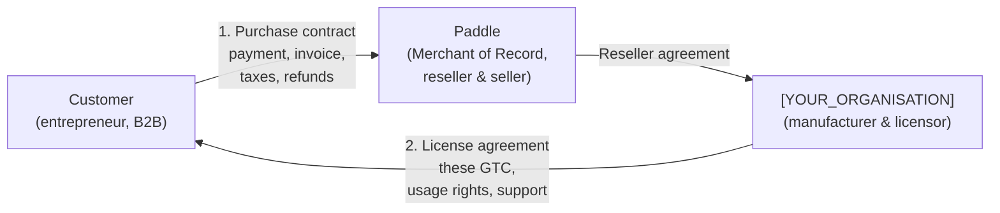
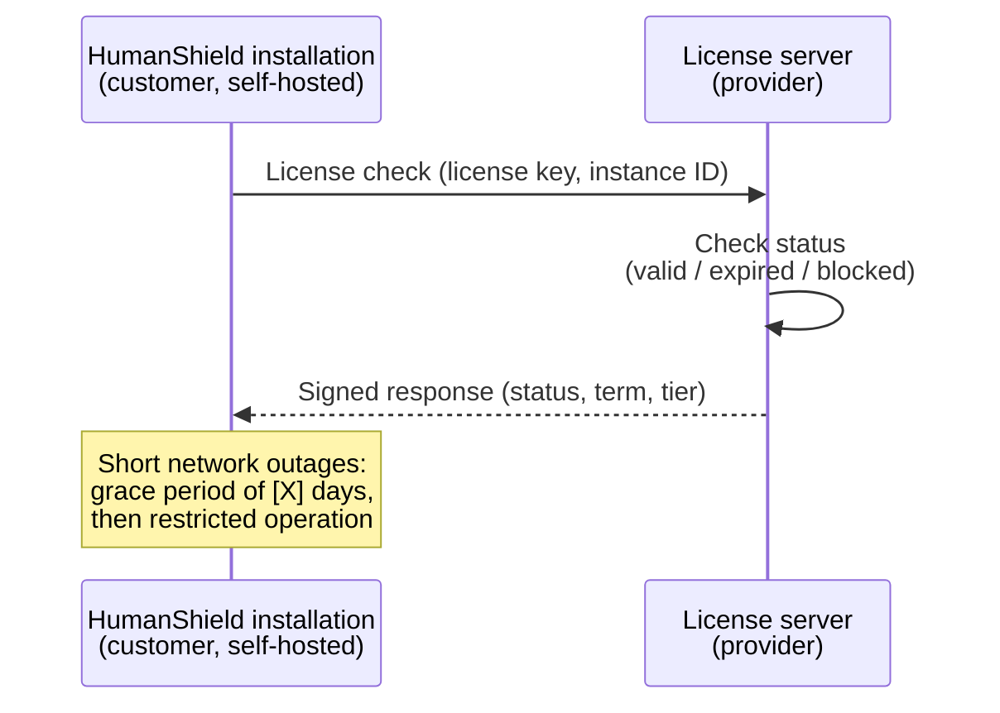

# General Terms and Conditions (GTC) & License Terms

<!--
NOTE: This is an English translation of the German "AGB" provided for
convenience. The legally binding version is the German one at /de/agb.
Have the final English wording reviewed by legal counsel before going live.
-->

*This English translation is provided for convenience only. The legally binding version is the [German original](/de/agb).*

**HumanShield – Phishing awareness training (self-hosted)**

**Version:** 1.0
**Effective from:** 11 July 2026
**Provider/Licensor:** HumanShield Awareness UG (haftungsbeschränkt), Lindental 8d, 94032 Passau (see [legal notice](/en/impressum))

---

## § 1 Scope and contract structure

### 1.1 Scope

These GTC govern the licensing and use of the **HumanShield** software in its paid variants (Business license and Enterprise add-on) as well as, additionally, the use of the free open-core variant.

The software is provided exclusively as a **self-hosted solution**: the customer installs and operates the software **on their own infrastructure**. The provider does **not** provide any SaaS, hosting or operational services.

### 1.2 B2B only — no consumer business

The offer is aimed **exclusively at entrepreneurs within the meaning of § 14 BGB (German Civil Code)**, legal entities under public law and special funds under public law.

- By completing the order, the customer confirms that they are acting as an entrepreneur.
- Consumers within the meaning of § 13 BGB are excluded from purchasing.
- **There is no right of withdrawal**, as the statutory withdrawal provisions (§§ 312g, 355 BGB) apply only to consumer contracts. Any goodwill refunds are governed exclusively by Paddle's refund policy (§ 4).

### 1.3 Contract structure: two contractual relationships

When purchasing a license, **two separate contractual relationships** are established:

**1. Purchase contract with Paddle:**
The customer's contractual partner for the **purchase** of the license (order, payment, invoicing, taxes) is:

> **Paddle.com Market Ltd.** or **Paddle.com Inc.** (depending on the region)
> Paddle acts as **Merchant of Record (reseller)** and is the seller of the license.
> The Paddle Buyer Terms apply additionally: https://www.paddle.com/legal/checkout-buyer-terms

**2. License agreement with the provider:**
The **usage rights** to the software as well as support and update services are governed by these GTC. The provider remains the licensor.

### 1.4 Sole contact for payment processing

**Paddle is the sole contact for all questions regarding payment processing**, in particular:

- Invoices and payment receipts
- Payment methods and failed payments
- VAT (including reverse charge with a valid VAT ID)
- Refunds and payment disputes

Contact: via the Paddle customer portal or https://www.paddle.net

The provider has **no access to the customer's payment data** and cannot issue or change invoices.

### 1.5 Deviating terms

Conflicting or deviating purchasing terms of the customer do not apply unless the provider expressly agrees to them in writing.

---

## § 2 Subject matter of the contract and scope of services

### 2.1 Product variants

| Variant | Acquisition | Operation |
|---|---|---|
| **Open Core** | Free (GitHub) | Self-hosted |
| **Business license** | Paid (annually, via Paddle) | Self-hosted |
| **Enterprise add-on** | Paid, **only as an upgrade to an active Business license** | Self-hosted |

### 2.2 Scope of functions

The currently valid and binding scope of functions of the individual variants can be viewed on the product website:

> **https://humanshield-awareness.de**

The scope of functions documented there at the time of license acquisition or renewal is authoritative. The provider reserves the right to further develop the scope of functions; § 10.2 (material changes) remains unaffected.

### 2.3 Enterprise add-on

The Enterprise add-on is **not a stand-alone product**, but is available exclusively as an **extension of an existing, active Business license**:

- Prerequisite: valid, non-blocked Business license
- Term: the add-on shares the term of the underlying Business license
- If the Business license is cancelled, expires or is blocked, the **Enterprise add-on ends automatically**
- Price: see product website

### 2.4 Self-hosted: allocation of responsibilities

Since the customer operates the software on their own infrastructure, the following allocation applies:

| Area of responsibility | Provider | Customer |
|---|---|---|
| Provision of the software (download) | ✅ | — |
| License server operation (license check, § 3.4) | ✅ | — |
| Installation, configuration, operation | — | ✅ |
| Server, network, operating system | — | ✅ |
| Backups & disaster recovery | — | ✅ |
| Securing one's own infrastructure | — | ✅ |
| Availability of the customer installation | — | ✅ |
| Applying updates | — | ✅ (provision: provider) |
| GDPR compliance towards end users | — | ✅ (customer = controller) |

The provider owes **no availability of the customer installation** and no operational services.

---

## § 3 License and usage rights

### 3.1 Open Core (free)

The open-core variant is provided under the open-source license specified in the repository (GitHub, organization *HumanShield Awareness UG*). Only the license text there applies.

**The open-core variant is provided without any warranty, guarantee or support commitment ("as is").** There are no claims to error correction, updates, support or specific functions. § 8.1 applies accordingly.

### 3.2 Business license and Enterprise add-on (commercial)

Upon full payment, the customer receives, for the term of the contract, a **simple, non-exclusive, non-transferable and non-sublicensable right** to operate the software within the licensed scope (number of users, scope of functions according to license tier) on their own infrastructure.

**The following in particular is not permitted:**

- Use beyond the licensed number of users
- Transfer, rental, lending or sublicensing of the license
- Use of a license by several legally independent companies (except affiliated companies within the meaning of § 15 AktG, if agreed in the license)
- Circumvention, deactivation or manipulation of the license check (§ 3.4)
- Removal of copyright and license notices

Decompilation is permitted only within the narrow limits of § 69e UrhG (German Copyright Act).

### 3.3 License delivery

After successful payment via Paddle, the license key is delivered automatically to the email address provided at purchase (target: within a few minutes). In case of delay: support@humanshield.app.

### 3.4 Online license check

The software validates the license **online against the provider's license server**:

**The following applies:**

- For the license check, the customer installation requires an **outbound internet connection to the provider's license server** (endpoint and frequency according to the technical documentation).
- Only the data required for the license check is transmitted (license key, instance identifier, product version, timestamp). **No training or end-user data** leaves the customer installation.
- In the event of temporary unavailability of the license server, a **grace period of 14 days** applies (the last valid license status is cached locally). After the grace period expires without a successful check, the software switches to a restricted mode.
- The provider is entitled to **block licenses server-side** in the event of non-payment, chargeback or violations of § 3.2 (procedure: § 9.3).
- The provider will ensure the availability of the license server with the diligence of a prudent businessperson; the grace period ensures that short-term outages of the license server do not affect the customer's operation.

---

## § 4 Prices, payment and term

### 4.1 Billing exclusively annual

Licenses are offered **exclusively with an annual term and annual billing in advance**. There is no monthly payment option.

### 4.2 Prices

The prices shown at the time of ordering on **https://humanshield-awareness.de** or in the Paddle checkout apply. Prices are net; VAT is calculated and shown by Paddle in accordance with the applicable tax regulations (with a valid VAT ID, reverse charge may apply).

### 4.3 Payment processing via Paddle

- Payment, invoicing and tax remittance are carried out **exclusively by Paddle** as Merchant of Record (§ 1.3, § 1.4).
- The payment methods offered in the Paddle checkout apply.
- **Refunds** are governed exclusively by Paddle's refund policy and are processed by Paddle. There is no further refund claim against the provider.

### 4.4 Renewal

The license renews automatically for **12 months** at a time, unless it is cancelled in accordance with § 9.1. The renewal payment is collected by Paddle on the respective due date.

### 4.5 Non-payment

If a renewal payment fails or a chargeback occurs, the provider is entitled to block the license server-side after the unsuccessful expiry of a grace period of **14 days** set by email (§ 3.4, § 9.3).

---

## § 5 Support and updates

### 5.1 Support scope (commercial licenses only)

| Service | Open Core | Business | Business + Enterprise add-on |
|---|---|---|---|
| Community (GitHub issues) | ✅ | ✅ | ✅ |
| Email support | ❌ | ✅ (response time: [1] business days) | ✅ (response time: [4] hours) |
| Support with installation/update | ❌ | limited | ✅ |
| Prioritized handling | ❌ | ❌ | ✅ |

Support includes assistance with the intended use of the software. **Not included** are: operation of the customer infrastructure, individual development, customizations, consulting services (can be commissioned separately).

Response times are target values within business hours (Mon–Fri, 09:00–17:00, Germany, federal state of Bavaria, excluding public holidays); they do not represent restoration times.

### 5.2 Updates

During the license term, the provider makes updates available for download (error corrections, security updates, functional enhancements). **Applying the updates is the responsibility of the customer.** There is no claim to specific future functions.

---

## § 6 Customer obligations

### 6.1 Intended use

The software serves exclusively to **raise awareness among and train one's own employees** (or the employees of customers, provided the customer acts as a commissioned service provider with the corresponding authority).

**In particular, the following is prohibited:**

- Use against persons or organizations **without their authorization/commission** (real phishing, § 202a et seq. StGB, among others)
- Use to obtain the access credentials of third parties outside authorized simulations
- Any unlawful use

In the event of a violation, the provider is entitled to terminate without notice and immediately block the license; further claims are reserved.

### 6.2 Data protection and employment law responsibility

The customer operates the software on their own infrastructure and is the **sole controller under data protection law** (Art. 4 no. 7 GDPR) for the processing of end-user data. In particular, the customer ensures:

- A legal basis for phishing simulations (e.g. legitimate interest, works agreement)
- Involvement of the works council, where required (§ 87 BetrVG)
- Information of employees pursuant to Art. 13/14 GDPR to the extent required

Since no end-user data is transmitted to the provider (§ 3.4), a data processing agreement for the operation of the software is generally not required.

### 6.3 Cooperation

The customer ensures the technical prerequisites in accordance with the system requirements (see documentation), including the outbound connection to the license server (§ 3.4).

---

## § 7 Warranty (commercial licenses)

7.1 The statutory warranty law applies with the following provisions for entrepreneurs.

7.2 The customer must report obvious defects without delay, at the latest within **14 days** of discovery, in text form.

7.3 The limitation period for claims for defects is **12 months** from license delivery, except in cases of intent, gross negligence and damage arising from injury to life, body or health.

7.4 The following in particular are not defects: errors resulting from improper installation/configuration by the customer, modifications by the customer, operation outside the system requirements, failure to apply updates.

7.5 **For the open-core variant, § 3.1 applies exclusively** (no warranty).

---

## § 8 Liability

8.1 The provider is liable without limitation in the event of intent and gross negligence, in the event of injury to life, body or health, under the Product Liability Act, and to the extent of a guarantee assumed.

8.2 In the event of slightly negligent breach of material contractual obligations (cardinal obligations), liability is limited to the **damage typical of the contract and foreseeable**, up to a maximum of the **license fees paid by the customer in the last 12 months before the damaging event**. Otherwise, liability for slight negligence is excluded.

8.3 **There is in particular no liability for:**

- Damage caused by real phishing or cyber attacks by third parties; the software increases awareness but does not guarantee protection against attacks
- Data loss, to the extent it could have been avoided by proper data backup by the customer (§ 2.4)
- Outages of the customer infrastructure

8.4 The limitations of liability also apply in favor of the provider's officers, employees and vicarious agents.

---

## § 9 Term, cancellation, license blocking

### 9.1 Ordinary cancellation

The license can be cancelled by both parties **with a notice period of [30] days to the end of the respective annual term**:

- By the customer: via the **Paddle customer portal** (subscription management)
- By the provider: in text form to the email address on file

### 9.2 Extraordinary cancellation

The right to terminate without notice for good cause remains unaffected. Good cause for the provider exists in particular in the case of: violations of § 3.2 or § 6.1, chargeback without justified reason, non-payment after a grace period (§ 4.5).

### 9.3 License blocking (procedure)

Before a server-side blocking (except in cases of imminent danger, e.g. abuse under § 6.1):

1. Notice by email with a deadline (**7 days**)
2. After the deadline expires without result: blocking via the license server
3. Unblocking after the reason for blocking has been remedied

### 9.4 Consequences of termination

- The usage right expires at the end of the term; the software switches to restricted mode or to the open-core scope of functions (where technically provided)
- The Enterprise add-on ends automatically with the Business license (§ 2.3)
- **Customer data remains with the customer** (self-hosted) — a data export by the provider is neither necessary nor possible
- License/customer data stored by the provider is deleted in accordance with the privacy policy, unless statutory retention obligations exist

---

## § 10 Changes

### 10.1 Changes to these GTC

The provider may change these GTC with effect for the future. Changes are communicated to the customer in text form at least **30 days** before they take effect and apply from the next contract renewal. If the customer objects, the contract continues under the previous terms until the end of the current license period and then ends.

### 10.2 Price and service changes

Price changes take effect at the earliest from the **next renewal** and are announced at least **30 days** in advance. In the event of a material restriction of the scope of functions during the term, the customer has a special right of cancellation as of the time it takes effect.

---

## § 11 Final provisions

11.1 **Applicable law:** The law of the Federal Republic of Germany applies, excluding the UN Convention on Contracts for the International Sale of Goods (CISG).

11.2 **Place of jurisdiction:** The exclusive place of jurisdiction for all disputes arising from or in connection with this contract is Passau, Germany, provided the customer is a merchant, a legal entity under public law or a special fund under public law.

11.3 **Text form:** Changes and additions must be made in text form; this also applies to any waiver of this text form requirement.

11.4 **Severability clause:** Should individual provisions be or become invalid, the validity of the remaining provisions remains unaffected.

11.5 **Order of precedence:** For the acquisition (purchase/payment), the Paddle Buyer Terms take precedence; for usage rights, support and all other provisions, these GTC apply.

---

## Appendices & related documents

- 📄 [Legal notice](/en/impressum)
- 🔐 [Privacy policy](/en/datenschutz)
- 🛒 Paddle Buyer Terms: https://www.paddle.com/legal/checkout-buyer-terms
- 🌐 Feature overview: https://humanshield-awareness.de
