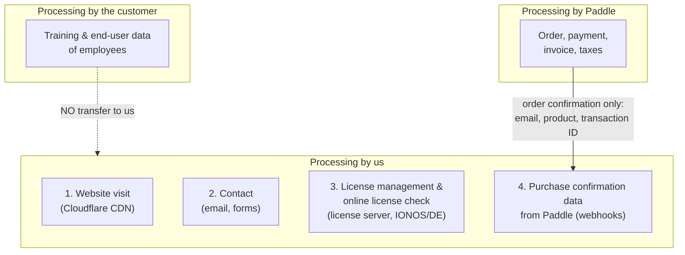

# Privacy policy

<!--
NOTE: This is an English translation of the German privacy policy provided for
convenience. The legally binding version is the German one at /de/datenschutz.
Have the final English wording reviewed by legal counsel before going live.
-->

*This English translation is provided for convenience only. The legally binding version is the [German original](/de/datenschutz).*

**HumanShield – humanshield.app / humanshield-awareness.de and its services**

**Version:** 1.0
**As of:** 11 July 2026

---

## 1. Controller

The controller within the meaning of the General Data Protection Regulation (GDPR) for the processing of personal data on this website and in the context of license management is:

```
HumanShield Awareness UG (haftungsbeschränkt) in formation
Lindental 8d
94032 Passau
Germany

Email: legal@humanshield.app
```

Further information: see the [legal notice](/en/impressum).

A data protection officer is [not appointed, as not legally required / appointed: NAME, CONTACT].

---

## 2. Overview: where do we process which data?

**Important note in advance — self-hosting principle:** The HumanShield software is operated by our customers **on their own infrastructure**. All training, simulation and employee data remains **entirely with the customer**. We have **no access** to this data and do **not** process it.

We process personal data in only four contexts:



---

## 3. Website visit (humanshield.app / humanshield-awareness.de)

### 3.1 Hosting and delivery via Cloudflare

Our website is provided as a static website via **Cloudflare Pages** (Cloudflare, Inc., 101 Townsend St., San Francisco, CA 94107, USA; for the EEA: Cloudflare Germany GmbH or Cloudflare, Inc. in accordance with the Cloudflare DPA).

When you access the website, Cloudflare processes the following for technical reasons:

- IP address
- Date and time of access
- Requested URL, referrer
- Browser type/version, operating system (user agent)
- Amount of data transferred, HTTP status code

**Purposes:** delivery of the website, load balancing (CDN), protection against attacks (DDoS, bots), error analysis.

**Legal basis:** Art. 6(1)(f) GDPR. Our legitimate interest lies in the secure, performant and attack-resistant provision of the website.

**Storage period:** Server logs are deleted or aggregated by Cloudflare after a short time; we do not store any access logs of the website ourselves.

**Transfer to third countries:** Cloudflare is certified under the **EU-U.S. Data Privacy Framework (DPF)**; additionally, **standard contractual clauses (SCC)** exist within the framework of the Cloudflare data processing agreement (Art. 28 GDPR).
Details: https://www.cloudflare.com/privacypolicy/

### 3.2 Cookies

We do **not** use any analytics, marketing or tracking cookies and do not use services such as Google Analytics or Meta Pixel.

Technically necessary cookies may be set by Cloudflare:

| Cookie | Purpose | Storage period | Legal basis |
|---|---|---|---|
| `__cf_bm` | Bot detection / security | approx. 30 minutes | § 25(2) no. 2 TDDDG; Art. 6(1)(f) GDPR |
| `cf_clearance` | Proof of passed security check | up to 1 year | § 25(2) no. 2 TDDDG; Art. 6(1)(f) GDPR |

Since only technically necessary cookies are used, no cookie consent banner is required.

---

## 4. Contacting us

If you contact us by email (support@humanshield.app) or via a contact form, we process the data you provide (name, email address, company, content of the request).

**Purpose:** processing and answering your request; initiating or performing a contract.

**Legal basis:** Art. 6(1)(b) GDPR (contractual / pre-contractual measures) or Art. 6(1)(f) GDPR (legitimate interest in answering general inquiries).

**Storage period:** deletion after final processing, at the latest after [12] months, unless statutory retention obligations (e.g. business correspondence pursuant to § 257 HGB, § 147 AO: 6 or 8/10 years) apply.

---

## 5. Ordering and payment via Paddle

### 5.1 Paddle as an independent controller

The purchase of HumanShield licenses is made via **Paddle** as **Merchant of Record (reseller)**:

> Paddle.com Market Ltd., Judd House, 18-29 Mora Street, London EC1V 8BT, United Kingdom
> (for buyers outside Europe, possibly Paddle.com Inc., USA)

Paddle is the **seller** of the license and processes the data collected in the context of the order and payment (name, email address, billing address, VAT ID, payment data) as an **independent data protection controller** — not on our behalf.

**Paddle is solely responsible** for payment processing, invoicing and refunds (see GTC § 1.4).

**Paddle privacy policy:** https://www.paddle.com/legal/privacy

**Payment data (credit card numbers, etc.) is never transmitted to us.**

### 5.2 What we receive from Paddle (webhooks)

After a purchase, renewal or cancellation, Paddle transmits the data required for license management to our license server via webhook:

- Email address of the buyer
- Name / company (if provided at checkout)
- Purchased product / license tier
- Transaction and subscription ID (Paddle references)
- Subscription status (active, cancelled, payment failed)

**Purpose:** creation, delivery, renewal and, if applicable, blocking of your license; assignment of support requests.

**Legal basis:** Art. 6(1)(b) GDPR (performance of the license agreement).

**Storage period:** for the duration of the license agreement plus [12] months; data relevant under commercial and tax law in accordance with statutory periods (§ 257 HGB, § 147 AO).

---

## 6. Online license check (license server)

### 6.1 How it works

The HumanShield software installed at the customer's premises validates its license **online against our license server**. This server is operated on a **Hostinger** server (Švitrigailos str. 34, Vilnius 03230 Lithuania) in a **German data center** and is hardened according to **BSI IT-Grundschutz principles** (including access control, logging, encryption of transmission via TLS).

### 6.2 Data processed

With each license check, only the following is transmitted and processed:

| Data | Purpose |
|---|---|
| License key | Assignment and status check of the license |
| Instance identifier (technical ID of the installation) | Detection of impermissible multiple use |
| Product version | Compatibility and security notices |
| Timestamp | Logging of the check |
| IP address (for technical reasons) | Connection establishment, abuse prevention |

**Expressly NOT transmitted:** names, email addresses or other data of the customer's employees, training results, simulation data, content of any kind. The license check contains no personal data of end users.

**Purpose:** checking license validity, protection against license abuse, defense against attacks on the license server.

**Legal basis:** Art. 6(1)(b) GDPR (performance of the license agreement) as well as Art. 6(1)(f) GDPR (legitimate interest in protection against license abuse and in the security of our systems).

**Storage period:** license server audit logs are deleted or anonymized after [90] days; security-relevant logs (e.g. in the event of attack detection) may in individual cases be retained until the incident is resolved.

### 6.3 Training and end-user data (self-hosted)

The actual application — phishing simulations, training content, evaluations, employee data — runs entirely **on the customer's infrastructure**. The controller for this processing under data protection law is **solely the customer**. We do not receive or process this data; a data processing relationship (Art. 28 GDPR) does not exist in this respect.

Employees of customer companies who have questions about a phishing simulation or the data processed in the course of it should contact their **employer** as the controller.

---

## 7. Open-core variant and GitHub

The free open-core variant is provided via **GitHub** (GitHub, Inc., USA — organization *HumanShield Awareness UG*). When accessing GitHub (download, issues, pull requests), the GitHub privacy policy applies: https://docs.github.com/privacy

If you create issues or make contributions there, GitHub processes your account data under its own responsibility; we see the content you post publicly.

---

## 8. Recipients and transfers to third countries

### 8.1 Overview of recipients

| Recipient | Role | Data | Location / processing | Safeguard |
|---|---|---|---|---|
| **Cloudflare** | Processor (website/CDN) | Access data (section 3) | USA / global | DPF certification, SCC, DPA |
| **Paddle** | Independent controller (seller) | Order and payment data (section 5.1) | UK / USA | UK adequacy decision; DPF/SCC |
| **Hostinger** | Processor (license server hosting) | License and check data (section 6) | Germany | DPA pursuant to Art. 28 GDPR |
| **GitHub** | Independent controller (open core) | Account/contribution data (section 7) | USA | DPF certification |
| **ProtonMail** | Processor (license delivery, support) | Email address, correspondence | Geneva, Switzerland | DPA pursuant to Art. 28 GDPR |

Transfers to other third parties only take place if we are legally obliged to do so (e.g. towards authorities) or you have consented.

### 8.2 Transfers to third countries

To the extent that data is transferred to the USA or the United Kingdom, this is based on:

- the **adequacy decision for the EU-U.S. Data Privacy Framework** (for DPF-certified recipients such as Cloudflare and GitHub),
- the **adequacy decision of the EU Commission for the United Kingdom** (Paddle.com Market Ltd.),
- additionally **standard contractual clauses (Art. 46(2)(c) GDPR)** with supplementary technical measures (transport encryption).

---

## 9. Your rights as a data subject

You have the following rights:

| Right | Basis |
|---|---|
| Access to processed data | Art. 15 GDPR |
| Rectification of inaccurate data | Art. 16 GDPR |
| Erasure | Art. 17 GDPR |
| Restriction of processing | Art. 18 GDPR |
| Data portability | Art. 20 GDPR |
| **Objection** to processing based on Art. 6(1)(f) GDPR | Art. 21 GDPR |
| Withdrawal of consent given, with effect for the future | Art. 7(3) GDPR |

**Exercising your rights:** informally to **legal@humanshield.app**. We respond within one month (Art. 12(3) GDPR).

**Note:** For order and payment data that Paddle processes as an independent controller, please direct data subject requests (also) directly to Paddle: https://www.paddle.com/legal/privacy — we forward requests addressed to us where necessary.

### Right to lodge a complaint

You have the right to lodge a complaint with a data protection supervisory authority (Art. 77 GDPR). The authority responsible for us is:

```
Bavarian State Office for Data Protection Supervision (BayLDA)
Promenade 18, 91522 Ansbach
https://www.lda.bayern.de
```

---

## 10. Data security

We take technical and organizational measures in accordance with Art. 32 GDPR, based on **BSI IT-Grundschutz**, including:

- TLS encryption of all connections (website and license server)
- Operation of the license server in a German data center with a hardened configuration (dedicated service accounts, key-based authentication, host firewall, intrusion detection, integrity monitoring, audit logging)
- Minimization principle: only the data required for license management and verification is processed (section 6.2)
- Encrypted, separate storage of cryptographic keys
- Regular security updates and review of systems

---

## 11. No automated decision-making

Automated decision-making, including profiling within the meaning of Art. 22 GDPR, does not take place. The automated license check (section 6) evaluates exclusively the technical license status and has no legal effect on natural persons.

---

## 12. Obligation to provide data

The provision of personal data is neither legally nor contractually required. However, without the data mentioned in sections 5 and 6, we cannot issue, deliver or check a license — the conclusion and performance of the license agreement are then not possible.

---

## 13. Changes to this privacy policy

We adapt this privacy policy when the legal situation, the services used or the processing activities change. The version published on the website at the relevant time applies. We inform existing customers about material changes by email.

---

## Related documents

- 📄 [Legal notice](/en/impressum)
- 📋 [Terms & Conditions](/en/agb)
- 🛒 Paddle Privacy Policy: https://www.paddle.com/legal/privacy
- ☁️ Cloudflare Privacy Policy: https://www.cloudflare.com/privacypolicy/
